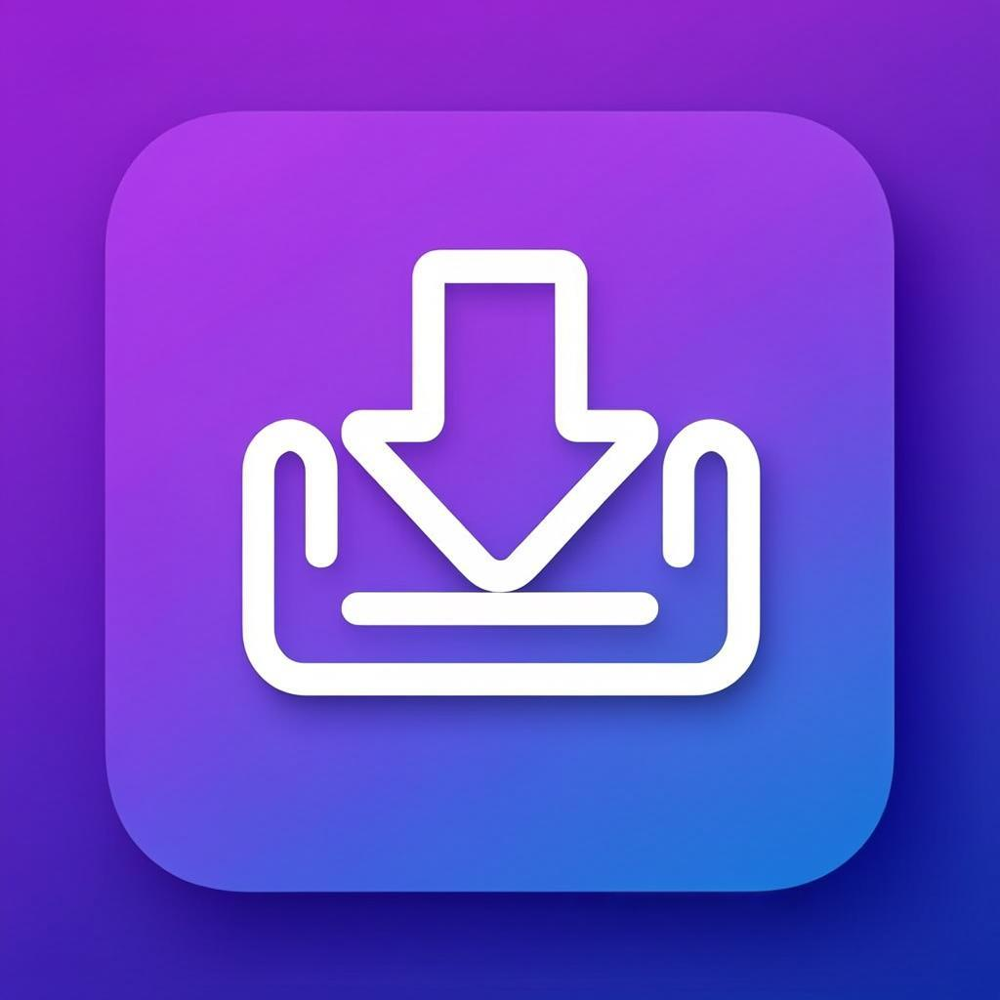

<p align="center">
  
</p>

<h1 align="center">VidGrab - محمّل الفيديوهات الاحترافي</h1>

<p align="center">
  <b>حمّل أي فيديو من أي منصة تواصل اجتماعي بسرعة فائقة وجودة عالية</b><br>
  
  
  
  
</p>

---

## ✨ المميزات

### 🎥 تحميل فائق السرعة
- تحميل سريع جداً بفضل خوارزميات التحسين المتقدمة
- دعم استئناف التحميل عند الانقطاع
- تحميل متوازي للملفات الكبيرة

### 📱 12+ منصة مدعومة
| المنصة | الدعم |
|--------|-------|
| YouTube | ✅ 1080p, 4K, MP3 |
| Instagram | ✅ Reels, Stories, Posts |
| TikTok | ✅ بدون علامة مائية |
| X (Twitter) | ✅ Videos, GIFs |
| Facebook | ✅ Reels, Videos |
| Snapchat | ✅ Spotlight, Stories |
| Pinterest | ✅ Videos, Pins |
| LinkedIn | ✅ Professional Videos |
| Reddit | ✅ Video Posts |
| Vimeo | ✅ HD, 4K |
| Dailymotion | ✅ All Qualities |
| Tumblr | ✅ Video Posts |

### 🎨 واجهة أنيقة وعصرية
- تصميم Material Design 3
- وضع داكن وفاتح
- حركات وتأثيرات سلسة
- دعم RTL كامل للعربية

### 📋 ميزات متقدمة
- كشف تلقائي للمنصة من الرابط
- اختيار الجودة قبل التحميل
- سجل تحميلات كامل
- إشعارات عند اكتمال التحميل
- دعم Deep Links من المتصفح

---

## 🚀 البدء السريع

### المتطلبات
- Flutter SDK >= 3.22.0
- Dart SDK >= 3.2.0
- Android Studio (لـ Android)
- Xcode 15+ (لـ iOS)

### التثبيت

```bash
# استنساخ المشروع
git clone https://github.com/yourusername/VidGrab.git
cd VidGrab

# تثبيت التبعيات
flutter pub get

# تشغيل على جهاز أو محاكي
flutter run
```

### بناء الإصدار

```bash
# Android APK
flutter build apk --release --flavor production

# Android App Bundle
flutter build appbundle --release --flavor production

# iOS
flutter build ios --release
```

---

## 📁 هيكل المشروع

```
VidGrab/
├── .github/workflows/      # GitHub Actions CI/CD
│   ├── build-android.yml   # بناء Android تلقائي
│   ├── build-ios.yml       # بناء iOS تلقائي
│   └── analyze-test.yml    # تحليل واختبار الكود
├── android/                # إعدادات Android
├── ios/                    # إعدادات iOS
├── assets/                 # الصور والأيقونات
│   ├── icons/              # أيقونات التطبيق
│   ├── images/             # الصور
│   └── lottie/             # رسوم Lottie
├── lib/
│   ├── config/             # الإعدادات والثيم
│   │   ├── theme.dart      # نظام الألوان والخطوط
│   │   └── routes.dart     # مسارات التطبيق
│   ├── models/             # نماذج البيانات
│   │   ├── video_info.dart # معلومات الفيديو
│   │   └── download_task.dart # مهمة التحميل
│   ├── screens/            # الشاشات
│   │   ├── splash_screen.dart
│   │   ├── home_screen.dart
│   │   ├── download_screen.dart
│   │   ├── history_screen.dart
│   │   └── settings_screen.dart
│   ├── services/           # الخدمات
│   │   ├── download_service.dart  # خدمة التحميل
│   │   └── platform_detector.dart # كشف المنصة
│   ├── widgets/            # العناصر المخصصة
│   │   ├── link_input_card.dart
│   │   ├── platform_grid.dart
│   │   ├── quality_selector.dart
│   │   ├── video_preview_card.dart
│   │   ├── stats_card.dart
│   │   └── featured_section.dart
│   └── main.dart           # نقطة الدخول
├── test/                   # الاختبارات
├── pubspec.yaml            # إعدادات الحزم
└── README.md               # هذا الملف
```

---

## 🛠️ التقنيات المستخدمة

| التقنية | الاستخدام |
|---------|-----------|
| Flutter 3.22 | إطار العمل الأساسي |
| Provider | إدارة الحالة |
| HTTP | طلبات الشبكة |
| Shared Preferences | التخزين المحلي |
| Flutter Animate | الحركات والتأثيرات |
| Google Fonts | خطوط احترافية |
| Iconsax | أيقونات حديثة |
| URL Launcher | فتح الروابط |
| Share Plus | مشاركة المحتوى |
| Connectivity Plus | مراقبة الشبكة |
| Permission Handler | صلاحيات النظام |

---

## ⚙️ GitHub Actions (CI/CD)

المشروع يحتوي على 3 workflows تلقائية:

### 1. 🚀 بناء Android
```yaml
# يعمل تلقائياً عند الدفع إلى main أو develop
# يبني APK لـ production و staging
# يرفع الملفات كـ Artifacts
```

### 2. 🍏 بناء iOS
```yaml
# يعمل تلقائياً عند الدفع إلى main أو develop
# يبني IPA للإصدار Release
# يحفظ النتائج كـ Artifacts
```

### 3. 🔍 تحليل واختبار
```yaml
# تحليل الكود بـ flutter analyze
# التحقق من التنسيق بـ dart format
# تشغيل الاختبارات بـ flutter test
# رفع تقرير التغطية
```

---

## 🔧 إعداد البحث الخلفي (Backend)

التطبيق حالياً يعمل ببيانات تجريبية. لتفعيل التحميل الحقيقي:

1. **خيار 1**: استخدم API عام مثل `cobalt.tools`
2. **خيار 2**: أنشئ خادمك الخاص باستخدام `yt-dlp`
3. **خيار 3**: استخدم Firebase Functions كـ backend

### مثال: ربط API حقيقي

```dart
// في lib/services/download_service.dart
// استبدل الدالة _fetchFromApi بـ:

Future<VideoInfo> _fetchFromApi(String url, VideoPlatform platform) async {
  final response = await http.post(
    Uri.parse('https://your-api.com/api/download'),
    headers: {'Content-Type': 'application/json'},
    body: jsonEncode({'url': url}),
  );
  
  final data = jsonDecode(response.body);
  return VideoInfo.fromApiJson(data);
}
```

---

## 📄 الرخصة

هذا المشروع مرخص تحت رخصة MIT. راجع ملف [LICENSE](LICENSE) للتفاصيل.

---

<p align="center">
  صنع بـ ❤️ بواسطة VidGrab Team<br>
  <sub>Download Anything, Anywhere</sub>
</p>